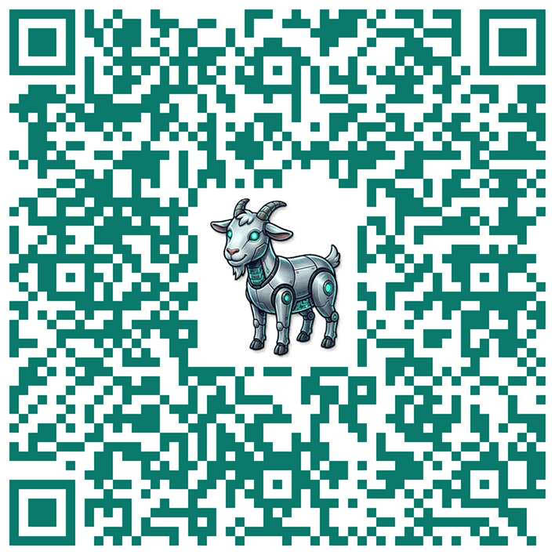

<!--
author:   Doug Holton

version:  0.0.1

logo:     docs/img/aipettingzoo.png

language: en

narrator: US English Female

comment:  AI tools and techniques to save instructors time and enhance student learning and engagement

import: https://raw.githubusercontent.com/LiaTemplates/BeforeAndAfter/main/README.md

import: https://raw.githubusercontent.com/LiaTemplates/CollaborativeDrawing/main/README.md

persistent: true

-->

# AI Petting Zoo

@beforeAndAfter(docs/img/aipettingzoo.png,docs/img/pettingzoo.png)

**Use the table of contents on the left to explore different AI tools and example tasks that may save you time and enhance student learning and engagement in your courses.**

**For a quick exploration of tools, check out:**

* [**Gemini**](https://gemini.google.com) and its features like deep research, images, videos, canvas  
* [**NotebookLM**](https://notebooklm.google/) and its features like podcasts, infographics, etc.  
* [**Playlab**](https://www.playlab.ai/) \- free but requires going through a training first, but see these [sample chatbots](https://www.playlab.ai/explore) created by instructors  
* [**Snorkl**](https://snorkl.app/) \- digital whiteboard that can give feedback to students as they work on problems you assign  
* [**EduGems**](https://www.edugems.ai/) and **[TeacherServer](https://teacherserver.com/teaching)** have collections of sample custom prompts and tools for instructors

**Short link to view this resource online:**

**[tinyurl.com/aipetzoo](https://tinyurl.com/aipetzoo)**
========================================

**Or point your phone camera at this QR code:**

## Tools

Explore various types of AI tools in the left sidebar or by navigating below, including:

* **AI Chatbots** \- general purpose AI chatbots including Gemini, Claude, and ChatGPT  
* **Research Tools** \- for you and your students  
* **Multimedia Tools** \- images, video, etc.  
* **Process Tracking** \- tools for letting students show the process they used to do their work  
* **Vibe Coding** \- create interactive apps and websites and games

**For more collections of educational AI tools, see:**

* [Which generative AI tool for your task](https://which-genai-tool-qjmdi3d.gamma.site/) \- by Nicole Hennig  
* [Generative AI Tools \- A Petting Zoo](https://docs.google.com/document/d/1sSdF-gr55QXBsBbMwYzNNJrmjWXtp_Q6rUUTk5fRhxw/edit?tab=t.0) \- hundreds of resources from Joyce Valenza  
* [Generative AI Product Tracker](https://sr.ithaka.org/our-work/generative-ai-product-tracker/) and [FuturePedia](https://www.futurepedia.io/) list hundreds of AI tools

**And here are some collections of AI pedagogy resources and tips and examples:**

* [Learn with AI](https://umaine.edu/learnwithai/) from U. Maine has several resources and strategies for adapting to AI in education  
* [AI Prompting Guide for Online Course Design](https://docs.google.com/document/d/1MwpEKSxSlNLSBmrAWjQdksPF4QGZfoRQkvv2zbSefOo/edit?usp=sharing)  
* [Exploring AI Pedagogy](https://exploringaipedagogy.hcommons.org/) \- a community collection from MLA  
* Free ebooks  
  * [Generative Artificial Intelligence: Practical Uses in Education](https://pressbooks.openedmb.ca/aiineducation/)   
  * [Teaching and Generative AI: Pedagogical Possibilities and Productive Tensions](https://www.usu.edu/empowerteaching/publications/books/teaching-ai/)

### AI Chatbots

General purpose AI chatbots. These chat apps can do more than text chat \- they can generate images, videos, deep research reports, and custom interactive apps and websites.  
.

* [Gemini](https://gemini.google.com/app) \- from Google, with a huge [ecosystem of supporting AI apps](https://ai.google/products/), including [NotebookLM](https://notebooklm.google/). Students can get a [free year of Gemini Pro](https://gemini.google/students/).  
* [Claude](https://claude.ai) \- good at creative writing and coding ([Claude Code](https://claude.com/product/claude-code)), but can get expensive.  
* [ChatGPT](https://chatgpt.com/) \- most popular chatbot. Requires paying for Pro account to create custom GPTs.  
* [HuggingChat](https://huggingface.co/chat/) \- free, private, and open source. Part of [HuggingFace](https://huggingface.co/), a repository of open weight and open source AI models and data sets. See their interactive [Spaces](https://huggingface.co/spaces), including [OCR apps](https://huggingface.co/spaces?category=ocr&sort=trending)  
* Others include Microsoft Copilot, Poe, Perplexity, Deepseek, Z.ai, etc.

#### Create a Custom Chatbot

Create an AI chatbot your students can use for learning support.

* [NotebookLM](https://notebooklm.google/) \- upload your course materials and share the link to the notebook, which students can use to answer questions and generate study materials. NotebookLM can be used to generate ancillary materials such as podcasts, videos, infographics, quizzes, flash cards, etc. Examples:  
  * [Public NotebookLM notebooks for OpenStax textbooks](https://workspaceupdates.googleblog.com/2025/09/public-notebooks-partnership-with-openstax.html)  
  * [College Success](https://notebooklm.google.com/notebook/3aa47a4d-ed3c-4c73-b11e-793d8ce95627) \- notebook with the OpenStax College Success book attached  
  * [Ethical AI Use for Academic Success](https://notebooklm.google.com/notebook/0fed3ab1-baee-4fb9-bbc8-85a4b016330d)  
  * You can also use NotebookLM to research and explain topics for you. For example:  
    * [Strategies for Reducing Student Misuse of AI](https://notebooklm.google.com/notebook/e1f0f224-4f6c-465b-b7e5-546569528b87) \- see also this [presentation on the topic](https://docs.google.com/presentation/d/1htjhjS7-cLx8BfdL2aZZ40B8opUz1ckZedcxmeJYUco/edit?usp=sharing)  
* [Playlab](https://www.playlab.ai/) \- completely free to create custom chatbots. You can attach files and resources. Designed for educators. You can see student chat logs.  
  * [Sample Playlab apps](https://www.playlab.ai/explore)  
  * [Course builder](https://www.playlab.ai/project/cmn8y9pex0vkjmi0wnq1tsjmu) \- testing this out, may time out  
* [Creating a Custom Gemini Gem](https://support.google.com/gemini/answer/15235603?hl=en) \- examples:  
  * [EduGems](https://www.edugems.ai/) has a directory of several educational Gems. See also the [EduGem Generator](https://www.edugems.ai/gem/edugem-generator) for assistance creating your own  
  * [Alt Text Generator](https://gemini.google.com/gem/1qkiILxWUW1tGeVb9IOICQCREKmEIuhNS?usp=sharing) \- describe an image  
  * [Hawkulus \- Calculus learning coach](https://gemini.google.com/gem/17evrnT3R-s_jQNtckS3O7s9IsYWvQ4MB?usp=sharing) \- ([system instructions](https://docs.google.com/document/d/1p2aeeVmstAASRUsgH52NLDmhghrhhsab2pvmyevnuYI/edit?usp=sharing))  
  * [Online module designer](https://gemini.google.com/gem/1sPeVIqY5wtESVwGFn6kmgFNon0UXTV6S?usp=sharing)  
* [Creating a Custom GPT in ChatGPT](https://help.openai.com/en/articles/8554397-creating-a-gpt) (this requires a paid ChatGPT account). Examples:  
  * [Alt Text Generator](https://chatgpt.com/g/g-67583ac30c508191b91e1fcfab611f31-alt-text-generator) \- describe an image  
  * [Hawkulus \- Calculus learning coach](https://chatgpt.com/g/g-68d992b987fc8191b6b394cb1dfd1593-hawkulus-calculus-learning-coach) \- ([system instructions](https://docs.google.com/document/d/1p2aeeVmstAASRUsgH52NLDmhghrhhsab2pvmyevnuYI/edit?usp=sharing))  
  * See also these [5 GPTs for Instructors from the OpenAI Academy](https://academy.openai.com/public/blogs/built-for-better-teaching-5-gpts-every-faculty-member-should-use-2025-08-13)  
* Other free or open source options  
  * [OnMicro](https://onmicro.ai/) \- [source code](https://github.com/onmicroai/micro_ai)  
  * [Axiom](https://axiomai.ca/)  
* Prebuilt tutoring chatbots  
  * [AI Tutor Pro](https://www.aitutorpro.ca) & [AI Teaching Assistant Pro](https://www.aiteachingassistantpro.ca/)

See the Tasks section below for several specific custom chatbot prompts and Gems.

### Teaching Tools

Examples of AI tools and prompts that can help with your teaching tasks.

* [EduGems](https://www.edugems.ai/) \- collection of Gemini Gems that you can use or copy & revise.  
* [TeacherServer](https://teacherserver.com/) \- created at USF \- see the [teaching section](https://teacherserver.com/teaching)  
* There are also many AI tools specifically created for teachers, but they often cost money:  
  * [TeacherMatic](https://teachermatic.com/), [MagicSchool](https://www.magicschool.ai/), [Eduaide](https://www.eduaide.ai/)

See the Tasks section below for several prompts and gems for specific teaching tasks.

### Research Tools

Tools to help you or your students research topics. Deep research is a new feature in AI chatbots in which the AI tool will search for and collect dozens of resources and compile a report with citations and references.

* [Gemini Deep Research](https://gemini.google/us/overview/deep-research/?hl=en) \- an option within Gemini to search for resources related to a topic and compile an in-depth report. Sample deep research reports:  
  * [Minimizing Generative AI Misuse in Asynchronous Online Higher Education](https://docs.google.com/document/d/10Um9eFtopV_aXb0OIr4cFPkltNhkJcDFhOTA0NiX4eU/edit?usp=sharing)  
  * [Comprehensive Blueprint for AI-Assisted Course Design](https://docs.google.com/document/d/1kdRy6SxbviiHgZjUcAPrrtnlpfHluRQ9A2db-LWj-jE/edit?usp=sharing)  
  * [The Higher Education AI Petting Zoo: A Strategic Resource for Instructional Innovation and Efficiency](https://docs.google.com/document/d/1mpjyMLsrZSeJw0ZK_BGz_hgjeq-3A3wPiSpewQUV3o0/edit?usp=sharing)  
* [NotebookLM](https://notebooklm.google/) \- integrates Gemini deep research, as well  
  * [Strategies for Improving Student Success in Gateway Courses](https://docs.google.com/document/d/1UWSv8Ime3quZWRG3zpuqj1JaQ3hdfEAuzFZfh3vR8bc/edit?usp=sharing)  
* [ChatGPT Deep Research](https://chatgpt.com/features/deep-research) \- example:  
  * [Minimizing AI-based Academic Dishonesty in Online Courses](https://docs.google.com/document/d/1mblSLVgHX3zrgYSyqQ4eke2hQPO6x_T0/edit?usp=sharing&ouid=105172824293093013179&rtpof=true&sd=true) \- compare with the above Gemini deep research report on the same topic  
* [Elicit](http://elicit.org/) \- retrieves papers with natural language search inputs and summarizes them using language models  
* [ResearchRabbit](https://www.researchrabbit.ai/) \- maps papers based on citations, co-authorship, and other metadata to generate visualizations of literature within a topic

### Image, Video Generation

AI tools for generating images, videos, podcasts, music, 3D scenes, etc.

* **Generate Images**  
  * [Gemini nano banana](https://gemini.google/overview/image-generation/) \- best image generation tool. You can generate complex images like infographics and precisely edit images, too.  
  * Other options:   
    * ChatGPT \- see this [ChatGPT image prompting guide](https://developers.openai.com/cookbook/examples/multimodal/image-gen-1.5-prompting_guide)  
    * [Adobe Firefox](https://firefly.adobe.com/)  
    * [Microsoft Designer](https://designer.microsoft.com/)  
* **Generate Infographics**  
  * [Gemini \- generate infographic](https://www.controlaltachieve.com/2025/11/infographics.html)  
  * [NotebookLM \- generate infographic](https://support.google.com/notebooklm/answer/16758265?hl=en)  
    * [Sample infographic on ethical AI use](https://github.com/edtechdev/aipettingzoo/blob/main/docs/img/ai-literacy-infographic.png?raw=true)  
* **Generate Videos**  
  * [Gemini Veo](https://gemini.google/overview/video-generation/)  
  * [Google Vids](https://workspace.google.com/products/vids/) \- sort of a combination of powerpoint and a video editor  
  * [NotebookLM \- generate video overview](https://support.google.com/notebooklm/answer/16454555?hl=en)  
    * [Sample video on using AI for learning](https://www.youtube.com/watch?v=-n-Yz5TcRn0)  
  * Other options ($$): [HeyGen](https://heygen.com/), [Wan](https://wan.video/), [Pika](https://pika.art/), [Synthesia](https://www.synthesia.io/)  
* **Generate Podcasts**  
  * [NotebookLM \- generate audio overview](https://support.google.com/notebooklm/answer/16212820?hl=en)  
    * [Sample podcast on ethical AI use](https://www.youtube.com/watch?v=jWul22Xuj4w)  
* **Generate Music / Songs**  
  * [Google Gemini Lyria](https://gemini.google/overview/music-generation/) \- recently released by Google  
  * Other options: [Suno](https://suno.com/), [Udio](https://www.udio.com/)  
* **Generate 3D Scenes / Games**  
  * [Project Genie](https://labs.google/projectgenie) \- from Google for generating 3D worlds  
  * [Omma](https://omma.build/) \- just released, can generate 3D scenes, games, web sites, apps

See also other [Google Labs Experiments](https://labs.google/experiments).

### Process Tracking

These tools show the editing history or record the process while a student writes or works on a problem. In some cases, AI can assist students during the process, as well, and/or give feedback to the student afterward. See also more resources below for reducing student misuse of AI in your courses.

* [TurnItIn Clarity](https://guides.turnitin.com/hc/en-us/articles/42696142721293-Turnitin-Clarity-Resource-Hub) \- records and plays back the editing history, and optionally can provide limited assistance to students during writing.  
* [Snorkl](https://snorkl.app/) \- digital whiteboard where students can work on a problem you’ve assigned. Their work is recorded, and AI can give the student feedback on their process afterward. They also have a writing tool. Free for up to 30 activities.  
* Other options: [Process Feedback](https://processfeedback.org/), [Grammarly Authorship](https://www.grammarly.com/authorship), [Revision History](https://chrome.google.com/webstore/detail/revision-history/dlepebghjlnddgihakmnpoiifjjpmomh/related)

**Simpler Process Tracking Techniques**

* **Document Version History** \- You can also have your students share the editing history in [Google Docs](https://support.google.com/docs/answer/190843?hl=en&co=GENIE.Platform%3DDesktop) or [Word](https://support.microsoft.com/en-us/office/view-previous-versions-of-office-files-5c1e076f-a9c9-41b8-8ace-f77b9642e2c2),  
* **Video Discussions** \- Another alternative is to have students submit videos instead of just text or files. For example a video where they explain or show how they solved a problem. Students simply click the Canvas Studio button in the Canvas rich content editor when replying to a discussion or submitting to a text entry assignment.  
  * [How students can submit/record videos in discussions using Canvas Studio](https://community.instructure.com/en/kb/articles/660547-how-do-i-embed-canvas-studio-media-in-a-discussion-reply-in-canvas-as-a-student)   
  * [How students can submit/record videos in assignments using Canvas Studio](https://community.instructure.com/en/kb/articles/660546-how-do-i-submit-canvas-studio-media-as-a-text-entry-assignment-in-canvas-as-a-student)

**Tracking Intentional AI Usage**  
If you are incorporating AI into an activity, but want to see how students use it, you can either have students share or link to their AI chat transcript, or use Playlab or a similar custom AI tool that keeps logs of the chats which you can access.

* [Playlab](https://www.playlab.ai/) logs the chats students have with your custom chatbot  
* [Share link to Gemini chat](https://support.google.com/gemini/answer/13743730?hl=en&co=GENIE.Platform%3DDesktop)  
* [Share link to ChatGPT chat](https://help.openai.com/en/articles/7925741-chatgpt-shared-links-faq)  
* ['Grade The Chats' is the 'Show Your Work' of the AI Age](https://mikekentz.substack.com/p/how-grading-the-chats-makes-learning)

**Other Strategies for Preventing AI Misuse**

* Test the [Susceptibility of Your Assessment Tasks to AI Misuse](https://www.teaching.unsw.edu.au/ai/ai-assessment-guidance#AI%20and%20assessment%20validity). I recommend you copy or take a screenshot of your assignment/discussion instructions or a quiz question and paste it into an AI tool like Gemini or ChatGPT. If the activity is susceptible to AI cheating, is there a way you could alter your rubric or instructions to make it more AI-resistant? For example, AI-generated writing is often missing the student's voice, connections to their experience. You might revise the activity to connect to the local community, or your activity instructions could refer to a Canvas Studio video or other internal resource that can't be copied or screen captured and pasted into an AI chatbot.  
* More [**Strategies for Reducing Student Misuse of AI**](https://docs.google.com/document/d/1CKGVICgEjkfp2hVkXQR4y8rNOKRajgjk5cbot52pE9Y/edit?tab=t.0#heading=h.qzzff6qhasni) (p.4 of handout, and see this [presentation](https://docs.google.com/presentation/d/1htjhjS7-cLx8BfdL2aZZ40B8opUz1ckZedcxmeJYUco/edit?usp=sharing))  
  * For example, you can indirectly reduce student's motivation to cheat by making your assessment activities more social, more authentic, and more formative and low-stakes.  
* **What to Do if You Suspect AI Misuse**: If you suspect a student has inappropriately used AI, see:  
  * [Addressing Suspected Misuse](https://sites.google.com/ucsd.edu/crafting-a-genai-and-ai-policy/home/the-fundamentals/when-genai-is-misused/addressing-suspected-misuse)   
  * [What to do when you detect or suspect AI-Generated Text](https://packback.co/platform/)  
* **Using AI Detectors**: We have [TurnItIn's AI writing detection](https://hcc.instructure.com/courses/145496/pages/turnitin), but be aware AI detectors have [low accuracy rates](https://arxiv.org/abs/2403.19148), which can lead to [false accusations](https://www.thedailybeast.com/ai-written-homework-is-rising-so-are-false-accusations) and potential [lawsuits](https://www.insidehighered.com/news/quick-takes/2026/02/11/adelphi-student-wins-ai-plagiarism-lawsuit). On average [1 out of 140 students will be falsely accused](https://foundation.mozilla.org/en/blog/who-wrote-that-evaluating-tools-to-detect-ai-generated-text/) of cheating by these tools, according to a recent study. You shouldn't use an AI detector as the sole source of evidence for an academic integrity violation.  
  * Studies have found that [instructors cannot intuitively distinguish AI-generated text](https://www.sciencedirect.com/science/article/pii/S2666920X24000109) from student-generated text. This makes sense because these AI tools are trained until they generate text that is indistinguishable from human-generated text, as determined by human raters. There are no shortcut heuristics to determine whether text is AI-generated, such as lack of contractions, overuse of certain words, etc. One exception to this rule is that [people who frequently use generative AI can sometimes detect AI](https://arxiv.org/abs/2501.15654), picking up on more complex phenomena in the text.  
* **More AI & Academic Integrity Resources**  
  * Check out [Reinforcing Academic Integrity in the Age of AI: A Guide for Instructors](https://sites.google.com/ucsd.edu/crafting-a-genai-and-ai-policy/home) by Tricia Bertram Gallant and her book [*The Opposite of Cheating*](https://www.theoppositeofcheating.com/). That site has supporting resources and her podcast.  
  * Other presentations: [Managing AI Cheating](https://docs.google.com/document/d/1c_1vJlCtKY5vMd-7Rw0UH57VVv0SLQpHYkg4JmUs0to/edit?usp=sharing) by Eric Curts and [Guiding Students on Appropriate AI Use](https://annamills.substack.com/p/strategies-for-reducing-the-likelihood) by Anna Mills

### App Builders

Generate interactive apps, web sites, simulations, and games with just natural language descriptions of what you want (vibe coding). For some guidance and ideas on integrating interactive activities into instruction, see [How to Build Practice-Based Learning Activities with AI](https://drphilippahardman.substack.com/p/how-to-build-practice-based-learning).

* Generate Mini Apps / Simulations / Web pages  
  * [Gemini Canvas](https://gemini.google/overview/canvas/) \- option in Gemini to generate an interactive web app. These examples require being logged into Google/Gemini.  
    * Sample [related rates simulation for calculus](https://gemini.google.com/share/8a48cda4366e)  
    * Sample [time management quiz](https://gemini.google.com/share/970e66f49955)  
  * [Google Opal](https://opal.google/landing/?source=labs) \- new experimental tool to generate mini-apps, kind of slow  
  * [Claude Artifacts](https://www.descript.com/blog/article/artifacts-claude-ai) \- similar to Gemini Canvas  
* Vibe Coding \- generate even more interactive resources with just natural language  
  * [Omma](https://omma.build/) \- just released a week ago \- generate games, apps, web sites, 3D scenes…  
    * [HawkTimer Pomodoro Timer](https://omma.build/p/hawktimer-pomodoro-study-app-nu3ajg)  
    * [Sample AI Petting Zoo web page](https://omma.build/p/ai-petting-zoo-for-educators-wkzuq9)  
  * [Google AI Studio](https://aistudio.google.com/welcome) \- see also [Google Antigravity](https://antigravity.google/)  
  * [Github Copilot](https://github.com/features/copilot)  
    * [Sample College Success course](https://liascript.github.io/course/?https://raw.githubusercontent.com/edtechdev/teaching-agent/refs/heads/main/collegesuccessold.md) generated in VS Code w/Copilot using [liascript teaching-agent](https://github.com/edtechdev/teaching-agent)  
  * [Base44](https://base44.com/), [Cursor](https://cursor.com/), [Replit](https://replit.com/), etc. \- can get expensive  
  * [Codex](https://openai.com/index/introducing-the-codex-app/) from OpenAI  
* AI Agent Harnesses \- sophisticated agent coding harnesses that can use external tools, use the computer, gain new skills and iterate on their own or with your input (human-in-the-loop) until the job is done. These require more technical knowledge and a (usually expensive) API subscription or a computer with a powerful graphics card. And while they are very powerful, there are sometimes serious security risks, especially if you connect them to your personal accounts such as email.  
  * [Google Antigravity](https://antigravity.google/) \- visual agent IDE, and [Jules](https://jules.google.com/session), an autonomous agent  
  * [Claude Code](https://claude.com/product/claude-code) & [Cowork](https://claude.com/product/cowork) \- powerful but tight usage quotas, expensive  
  * [Hermes Agent](https://hermes-agent.nousresearch.com/) \- open source AI agent harness that can self-improve its skills and remember what it has learned. Bit more secure alternative to OpenClaw.  
  * [OpenCode](https://opencode.ai/) \- open source alternative to Claude Code  
  * [n8n](https://n8n.io/) \- AI workflow automation  
  * See the Generate a Course section below for examples of using AI agents.

## Tasks

Explore how you can accomplish various tasks with AI, including:

* **Student Support** \- such as creating a course chatbot to support students  
* **Course Design** \- build your course materials and activities  
* **Assessment** \- create quizzes, rubrics, etc.  
* **Accessibility** \- describe images, caption videos, fix your documents  
* **Feedback** \- help with crafting feedback for students

**Educational Gems and Prompt Libraries**  
And see these other collections of educational prompts and Gemini Gems:

* [EduGems](https://www.edugems.ai/) \- designed for use with Google Gemini. You can use or copy & revise the gems.  
* [TeacherServer](https://teacherserver.com/) \- created at USF \- see the [teaching section](https://teacherserver.com/teaching)  
* Prompt Libraries  
  * [AI for Education Prompt Library](https://www.aiforeducation.io/prompt-library)  
  * [Ethan Mollick prompt library](https://www.moreusefulthings.com/prompts) \- advanced prompts for students and instructors

**More Time-saving Tips**

* [Can AI Save Educators’ Time?](https://leonfurze.com/2024/03/21/artificial-intelligence-and-teacher-workload-can-ai-actually-save-educators-time/)  
* [AI could free up faculty time to focus on the teaching and relationship-building](https://www.insidehighered.com/opinion/views/2024/04/23/ai-finally-way-reduce-higher-ed-costs-opinion)  
* [Time-Saving Gemini Tips for Teachers](https://classtechtips.com/2024/03/19/gemini-tips-for-teachers-259/)

### Student Support

#### Create materials for students

Using AI to generate supportive learning materials for your students. Some of these your students could use themselves.

* [NotebookLM](https://notebooklm.google/) \- use NotebookLM to create infographics, podcasts, slideshows, quizzes, flash cards, etc. for your course  
* Gemini Gems  
  * [Demonstrate a concept](https://gemini.google.com/?prompt_id=uGiQ5jvIMlNh) \- Gemini prompt  
  * [Real World Examples](https://www.edugems.ai/gem/real-world-examples) \- Gemini Gem \- brainstorm 3 relevant, specific, and authentic real-world connections (i.e., specific current or historical events, or age-appropriate news stories) for any academic topic or learning objective  
  * [Concept Analogies](https://www.edugems.ai/gem/concept-analogies) \- generating the full set of analogies with clear Mapping and Limitation sections  
  * [Guided Notes](https://www.edugems.ai/gem/guided-notes) \- transform any source text (video transcript, article, short story, or textbook chapter) into Comprehensive Guided Notes that function as a valuable study artifact  
  * [Worksheet](https://www.edugems.ai/gem/worksheet) \- create a highly customized worksheet for any learning experience, ensuring the formatting is clear for easy export to Google Docs or other word processors  
  * [Student Assignment Feedback](https://www.edugems.ai/gem/student-assignment-feedback) \- helps students receive immediate, detailed, and constructive feedback on their assignments before submission

See also the Generate an activity section below for tools for generating engaging activities for your students.

#### Share prompts for students

These sites share prompts that might be of use to students.

* [100 prompts for college students](https://chatgpt.com/use-cases/students) \- from ChatGPT  
* [Top 5 GPTs for students](https://academy.openai.com/public/blogs/ai-that-gets-you-top-5-gpts-for-students-2025-08-13) \- from OpenAI Academy  
* [Ethan Mollick Student Aids](https://www.moreusefulthings.com/student-exercises) \- prompts for students

#### Foster student AI literacy

See [AI Literacy Across the Curriculum](https://edtechdev.wordpress.com/2025/11/03/ailiteracy/) for several AI Literacy resources that may be of use in your course and with your students, including:

* [AI in Education](https://canvas.sydney.edu.au/courses/51655) is a Canvas course created by and for students.   
* For my college success course, I created an initial version of an AI Literacy module on [Ethically Using AI for College and Career Success](https://lor.instructure.com/resources/b1ce3679c02245c8b367756b0bc0ec84?shared), which includes scenarios to help students understand ethical uses of AI but also how improperly using AI as a shortcut for their own thinking [hurts their grades](https://news.mit.edu/2010/homework-copying-0318) and performance in the long term. It also includes a validated [Generative AI Literacy assessment test (GLAT)](https://www.sciencedirect.com/science/article/pii/S2666920X25000761?via%3Dihub) and an activity to design their own AI learning tools (I recently switched from Vibes.diy to [Omma.build](https://omma.build/)). Students will also be trying out Google’s [Career Dreamer](https://grow.google/career-dreamer/) AI tool to explore their career interests.    
* Montgomery College has also shared a free short ebook on [AI Literacy for Career & College Success](https://pressbooks.montgomerycollege.edu/ailit/), inspired by Elon University’s [2025 Student Guide to Artificial Intelligence](https://studentguidetoai.org/).   
* There are a few other AI Literacy modules in Canvas Commons, too, such as this [AI Literacy module from Cabrillo College](https://lor.instructure.com/resources/740f7f22ce9f4e3e897af0ced47ca716?shared).   
* [Promoting Critical AI Literacy through Online Video-based Discussion](https://stars.library.ucf.edu/topr/11/) – Video discussion boards can be done with Canvas Studio: see [How do I embed Canvas Studio media in a discussion reply in Canvas as a student?](https://community.canvaslms.com/t5/Canvas-Studio-Guide/How-do-I-embed-Canvas-Studio-media-in-a-discussion-reply-in/ta-p/1716) 

#### Create an AI course policy

* **Custom AI Tools**  
  * [Create AI Policy Statement for Syllabus](https://teacherserver.com/tool.php?id=687) \- on TeacherServer  
  * [AI Expectations](https://www.edugems.ai/gem/ai-expectations) \- Gemini Gem \- establish clear, pedagogy-driven AI boundaries for student assignments  
* See [Deciding on an AI Course Policy](https://sites.google.com/ucsd.edu/crafting-a-genai-and-ai-policy/home/the-fundamentals/the-rationale-for-policy/deciding-course-policy) for some guidance and examples.  
* Here also is a [list of some sample AI course policies](https://docs.google.com/document/d/1RMVwzjc1o0Mi8Blw_-JUTcXv02b2WRH86vw7mi16W3U/edit?usp=sharing) from other schools and see below for a couple of sample ones for a composition course  
* See also this [AI Policy Flowchart](https://www.umass.edu/ctl/how-do-i-consider-options-may-increase-likelihood-students-will-follow-my-generative-ai-course) and this [AI Continuum](https://ditchthattextbook.com/ai-cheating/) from "all AI" to "all human" coursework

**Sample Course Policy \- Banning AI**

*As an English composition teacher, I believe that the goal of this course is to develop and improve students' writing skills, critical thinking, and independent research abilities. Therefore, the use of ChatGPT or any similar tool to assist students with their writing is strictly prohibited in this class.*   
*While these tools may provide students with quick solutions and suggestions, they do not foster the development of critical thinking and writing skills that are essential for success in academic and professional environments. Furthermore, using these tools to generate content for assignments or essays undermines the core principles of academic integrity and originality.*

**Sample Course Policy \- Allowing Ethical Use of AI**

*As your instructor, I encourage the use of technology as a tool for learning, but I also recognize the importance of ethical conduct in academic work. Therefore, in this course, we will use ChatGPT as a resource for writing and research, but we will do so in an ethical and responsible manner.*   
*Students are expected to acknowledge the use of ChatGPT in their work, and to properly cite any information or ideas obtained from this platform in accordance with the guidelines established in the course. Plagiarism, whether intentional or unintentional, is not acceptable, and will result in penalties according to the severity of the offense.*

#### Let students create an app/chatbot

It’s simple enough now for students to create their own custom apps, games, and chatbots without any knowledge of programming. This might be an alternative to creating static text or videos.

* [Omma](https://omma.build/) \- brand new tool tool for generating games, apps, web sites, and 3D scenes  
* [Google Opal](https://opal.google/landing/) \- generate mini-apps  
* I was using the free and open source [Vibes DIY](https://vibes.diy/) but it’s down for now while they redesign it

#### Help students cope

* [Goblin Tools](https://goblin.tools/) \- to help manage studies and everyday tasks  
* [One Mind PsyberGuide](https://onemindpsyberguide.org/) \- reviews of mental health apps, including:  
  * [Calm](https://www.calm.com/)  
  * [Headspace](https://www.headspace.com/)  
* [VA Apps](https://mobile.va.gov/appstore/veterans?combine=&field_app_category_tid%5B%5D=3) \- Covid Coach, Cognitive Behaviorial Therapy (CBT) Coach, and many other free apps  
* [Merlin Bird ID](https://merlin.allaboutbirds.org/) \- see article on how [birdsongs alleviate anxiety](https://www.nature.com/articles/s41598-022-20841-0)

People (including students) are also using ChatGPT and other AI chatbots for therapy, and while these can be [effective](https://home.dartmouth.edu/news/2025/03/first-therapy-chatbot-trial-yields-mental-health-benefits) if carefully designed and controlled, there can be serious [ethical risks](https://www.sciencedaily.com/releases/2026/03/260302030642.htm) if not.

#### Career development

* [Google Career Dreamer](https://grow.google/career-dreamer/home/) \- students can research their career interests and the job market. It creates a custom career coach for you in Gemini at the end of the process  
* [Job Interview Coach](https://www.edugems.ai/gem/job-interview-coach) \- Gemini Gem  
* [Write Reference Letter](https://teacherserver.com/tool.php?id=50) \- on TeacherServer  
* [Recommendation Letter](https://www.edugems.ai/gem/recommendation-letter) \- Gemini Gem

### Course Design

#### Generate learning objectives

* [SMART Learning Objectives Creator](https://gemini.google.com/gem/12Dr4LgXDXEui6KpdMoW0S6Ro101zotrE?usp=sharing) \- Gemini Gem based on this [guide on SMART learning objectives](https://ctltoolkit.s3.amazonaws.com/shelf/BSPHCTLLearningObjectivesGuide.pdf)  
* [Simplify learning objectives](https://gemini.google.com/?prompt_id=1s6phDtDsDCb) \- Gemini prompt  
* [Learning Objective Designer](https://chatgpt.com/g/g-jKlf8hRW2-learning-objective-designer)  \- custom GPT  
* [Learning Objective Creator](https://chatgpt.com/g/g-fe2iwBCJ9-learning-objective-creator) \- custom GPT

#### Generate a lesson plan

* [Lesson Plan](https://www.edugems.ai/gem/lesson-plan) \- Gemini Gem \-  clear instructions, differentiation strategies, and a suitable assessment, all tailored to your classroom context  
* [Lesson Planner](https://chatgpt.com/g/g-giTfIDl1a-lesson-planner) \- custom GPT for lesson plans for teachers with included hyperlinks, videos, and resources

#### Generate a presentation

AI can create slideshow presentations for you now. AI is now also incorporated into standard presentation tools like Google Slides and PowerPoint.

* Gemini Gems  
  * [Slideshow Maker](https://www.edugems.ai/gem/slideshow-maker) \- transform raw information—such as articles, notes, or uploaded files—into engaging, complete slide deck presentations  
* [Gamma.app](https://gamma.app/) \- here is a [sample site on which generative AI tool for your task](https://which-genai-tool-qjmdi3d.gamma.site/)  
* Google has Gemini AI slideshow features in [Google Slides](https://workspace.google.com/resources/presentation-ai/) and [NotebookLM](https://support.google.com/notebooklm/answer/16757456?hl=en)  
* Other options: [Canva](https://www.canva.com/), [MagicSlides](https://www.magicslides.app/), [SlidesGPT](https://slidesgpt.com/), [Beautiful.ai](https://www.beautiful.ai/)

#### Generate an activity

**Activities**

* [Design student-centered activities](https://gemini.google.com/?prompt_id=U7mTFYZsq0b0) \- Gemini prompt  
* [AI Role Play Interview](https://www.edugems.ai/gem/ai-role-play-interview) \- allows your students to conduct a Classroom Interview with an expert AI  
* [AI Debate](https://www.edugems.ai/gem/ai-debate) \- allows your students to engage in a challenging, structured Point-Counterpoint debate with an expert AI

**Assignments**

* [Transparent Assignment Generator](https://gemini.google.com/gem/1gbbIFK5tP7cWZALvzXOSL3Lp8chuLrUF?usp=sharing) \- Gemini Gem \- uses the [Transparent assignment template](https://canvas.instructure.com/courses/3168265/assignments/23559299?module_item_id=50271930) to clarify your activities.  
* [Scenario-based Learning Designer](https://teacherserver.com/tool.php?id=161) \- on TeacherServer

**Discussions**

* [Discussion Prompt Generator](https://teacherserver.com/tool.php?id=89) \- on TeacherServer  
* [Discussion Prompts](https://www.edugems.ai/gem/discussion-prompts) \- Gemini Gem \- create a set of meaty, open-ended questions designed to stimulate meaningful classroom discussions

See the [TeacherServer teaching section](https://teacherserver.com/teaching) for several other examples.

#### Generate a syllabus

* [Draft a class syllabus](https://gemini.google.com/?prompt_id=kwwF9XOV9aSe) \- Gemini prompt  
* [Class Syllabus](https://www.edugems.ai/gem/class-syllabus) \- create a detailed and customized syllabus to clearly communicate your learning journey, expectations, and policies

#### Generate a course or module

* **Building Course Components One Prompt at a Time** \- this is the safest and easiest way to generate course materials and activities, by prompting AI to generate one piece at a time, and iterating and improving on what is generated before pasting or using the results.  
  * [AI Prompting Guide for Online Course Design](https://docs.google.com/document/d/1MwpEKSxSlNLSBmrAWjQdksPF4QGZfoRQkvv2zbSefOo/edit?usp=sharing) \- collection of suggested prompts for building an online course piece by piece  
  * Philippa Hardman has articles on [using AI to aid instructional design](https://drphilippahardman.substack.com/p/taker-maker-shaper?isFreemail=true&post_id=142415382&publication_id=926556&r=1gwis&triedRedirect=true)  
* **One-shot Course Building?** \- If you prompt a standard AI chatbot like Gemini or ChatGPT to build an entire course in one shot, it likely will either not do a great job or run out of memory/time. However, here are experiments on that, if you want to try:  
  * [Course Builder](https://www.playlab.ai/project/cmn8y9pex0vkjmi0wnq1tsjmu) \- testing this out in Playlab, it will likely time out before completing the entire course  
  * [SCORM Course Builder](https://chatgpt.com/g/g-vj3Fiz8Q5-scorm-course-builder) \- Custom GPT \- SCORM is a format that can be imported into your LMS. This had some issues when I tried it  
* **Generate a Module** \- A compromise, middle way solution is to ask AI to generate a module, rather than an entire course. Here are experiments with that:  
  * [Online Module Developer](https://teacherserver.com/tool.php?id=49) \- on TeacherServer  
  * [Online Module Designer](https://gemini.google.com/gem/1sPeVIqY5wtESVwGFn6kmgFNon0UXTV6S?usp=sharing) \- testing this Gemini Gem out  
* **Semi-autonomous AI Agents** \- It is technically possible now to use AI agents to generate course materials, but it still requires some technical knowledge, it often has costs to use an AI API, and there are still some limitations. In this situation, an AI agent would work with you to first collect information about the course, then generate a plan, and then handoff the work in an iterative cycle to build each component of the course (with your input and feedback along each step of the way). Finally, it would export the course in a usable format (for example a web app or SCORM module or IMS common cartridge). Here’s an experiment with that:  
  * [Sample College Success course](https://liascript.github.io/course/?https://raw.githubusercontent.com/edtechdev/teaching-agent/refs/heads/main/collegesuccessold.md) generated in VS Code w/Copilot using [liascript teaching-agent](https://github.com/edtechdev/teaching-agent).    
    * Compare with this demo from three years ago of generating [liascript](https://liascript.github.io/) courses: [Eduweaver](https://github.com/aneesha/eduweaver)

**Getting materials into Canvas**

* The safest option is of course just you manually copying and pasting material into Canvas.  
* Technically, it is possible to have AI generate a zip file with materials properly formatted for import into Canvas. But one little mistake in the formatting, and the input will not work.  
* Not secure and not recommended at all \- yes, it is possible now for AI to interact with Canvas directly, either through the [Canvas API](https://clawhub.ai/skills?q=canvas-lms) or by using the browser, but there are serious security and privacy and ethical risks. I just share that info because some instructors and students are using this. There was a story of someone who got their AI agent harness (OpenClaw) to go to their course and complete all their work for them, for example.

### Assessment

#### Generate formative assessments

Activities where students can learn from the assessment, or you can learn from them by collecting their feedback.

* [Formative Assessment Generator](https://teacherserver.com/tool.php?id=150) \- on TeacherServer  
* [Exit Ticket](https://www.edugems.ai/gem/exit-ticket) \- Gemini Gem \- create high-quality, targeted exit tickets to assess student understanding at the end of any lesson

#### Generate a quiz

It’s probably easiest to just directly ask Gemini or NotebookLM to generate a quiz for you, but the more precise you are about what you want, the better result you’ll get. Remember you can iterate on it, suggest improvements, edits, etc. You can try asking Gemini or ChatGPT to convert a quiz into the QTI format for importing into Canvas, but it may not always work.

* [Generate a quiz](https://gemini.google.com/?prompt_id=ukQf42NvlKym) \- Gemini prompt  
* [YouTube Quiz](https://www.edugems.ai/gem/youtube-quiz) \- Gemini Gem \- generate a quiz based on a Youtube video.  
* [Text-dependent Questions](https://www.edugems.ai/gem/text-dependent-questions) \- Gemini Gem \- generate a set of rigorous, text-dependent questions tied directly to any provided text or instructional content

#### Generate rubrics/exemplars

* [Rubric](https://www.edugems.ai/gem/rubric) \- Gemini Gem \- generate a detailed rubric for any assignment. It ensures the rubric's criteria are specific and measurable, the performance levels are distinct, and the overall design promotes fair and transparent grading for students.  
* [Universal Rubric Designer for Canvas](https://chatgpt.com/g/g-6872fdeebbfc81919b181aed0a659447-universal-rubric-designer-for-canvas) \- Custom GPT  
* [Rubric Generator](https://teacherserver.com/tool.php?id=44) \- on TeacherServer

Providing examples (student exemplars) can sometimes be even more effective than rubrics (or you can use both):

* [Exemplar & Non-Exemplar Responses](https://www.edugems.ai/gem/exemplar-non-exemplar-responses) \- quickly generate differentiated model student responses, including both high-quality (exemplar) and low-quality (non-exemplar), based on your assignment and rubric

#### Authentic assessment

Authentic and alternate assessment involves having students do activities that are more like they are done in the real world or workplace. This also [benefits engagement & employability](https://www.sciencedirect.com/science/article/abs/pii/S0191491X21000560).

You might wish to explore alternate and more authentic assessment techniques by searching for or asking AI about terms like: authentic learning, authentic assessment, specifications grading, ungrading. AI can assist you with generating ideas for these kinds of activities.

In some cases, it might be appropriate for students to use AI as part of the activities, too (see examples below). One rule of thumb is to think about how an activity is done in the real world. Would they use AI to assist them? If so, it might be feasible to consider letting students use AI, too, in a controlled, guided manner.

* [Brainstorm Real World Examples](https://gemini.google.com/?prompt_id=mHLf8EnJK3LL) \- Gemini prompt  
* [Real World Examples](https://www.edugems.ai/gem/real-world-examples) \- Gemini Gem \- brainstorm 3 relevant, specific, and authentic real-world connections (i.e., specific current or historical events, or age-appropriate news stories) for any academic topic or learning objective  
* [Alternate Assessment](https://www.edugems.ai/gem/alternate-assessment) \- Gemini Gem \- generate high-quality alternate versions of your existing quizzes or tests  
* [40 AI Alternate Assessment ideas](https://repository.jisc.ac.uk/9234/1/assessment-ideas-for-an-ai-enabled-world.pptx) (PPT)

See also this [Alternative Assessment Guide](https://www.yorku.ca/bold/wp-content/uploads/sites/393/2020/11/Guide_Alternative_Assessments.pdf) and [35 example alternative assessments](https://alternative-assessment.com/?page_id=219).

### Accessibility

Use AI to generate alt text descriptions of image, more accurate captions and transcripts for videos, and fix accessibility issues in documents such as PDFs.

#### Generate alt text for an image

Generate alternative text (alt text) descriptions of images, diagrams, charts, infographics...

* [Image Accessibility Generator](https://teachonline.asu.edu/image-accessibility-generator/) \- from ASU generates a description of an image you upload  
  * [Alt Text](https://www.edugems.ai/gem/alt-text) \- Gemini Gem version  
  * [Alt Text Generator](https://chatgpt.com/g/g-67583ac30c508191b91e1fcfab611f31-alt-text-generator) is a ChatGPT bot created by CITT, based on the ASU one.  
* And see this guide on [How to Write Alt Text](https://www.perkins.org/resource/how-write-alt-text-and-image-descriptions-visually-impaired/)

#### Generate captions for a video

Generate accurate captions (with proper spelling, punctuation, ...) or transcripts. This is less necessary now that Youtube, Canvas Studio, and other video tools are starting to use AI to generate better captions.

* [Vibe](https://thewh1teagle.github.io/vibe/) is a free and open source Windows app that uses Whisper under the hood to transcribe videos or audio.  
* You can also paste in an existing transcript for a video and ask AI to correct it for spelling and punctuation.

#### Fix PDF accessibility

* [PDF Accessibility Remediation](https://www.remediate-pdf.com/) \- AI-based tool from ASU, limited to three 10-page PDFs in the free demo. Beyond that the costs may range up to $6 per 100 pages processed.  
* Try out [olmOCR](https://olmocr.allenai.org/) , [paddleOCR](https://huggingface.co/spaces/PaddlePaddle/PaddleOCR-VL_Online_Demo), [MinerU](https://huggingface.co/spaces/opendatalab/MinerU), [RolmOCR](https://huggingface.co/reducto/RolmOCR) and other free and open source multimodal AI OCR tools \- most demos are limited  
* [Google AI Studio](https://aistudio.google.com/) \- Select an AI model such as Gemini 3 Flash and use a prompt such as (depending on the nature of the task): Extract the names and ID numbers from this PDF into a table  
* [MathPix](https://mathpix.com/) can recognize math and scientific formulas and equations, however it costs money  
* [PAVE PDF](https://www.perkins.org/resource/pave-web-tool-check-pdf-accessibility/) \- old, free tool that can fix many issues with PDFs, but doesn't use AI (can't describe images for you, for example)

### Feedback

#### Use AI for student feedback

AI can give students feedback, or suggest feedback to you as a starting point. Careful of ethical issues with using AI for grading.

**AI Feedback Prompts and Custom Gems**

* See the [Feedback Helper](https://academy.openai.com/public/blogs/built-for-better-teaching-5-gpts-every-faculty-member-should-use-2025-08-13) example at the bottom of that page  
* Grading \- don’t share student information  
  * [Grading Partner](https://www.edugems.ai/gem/grading-partner) \- Gemini Gem \- Acting as a supportive "Grading Partner" and co-teacher, it strictly adheres to your provided rubric to generate a two-part report: a formal evaluation for your records and a personalized feedback letter for the student  
  * [ChatGPT Help with Grading](https://blog.tcea.org/chatgpt-grading/) \- don’t share student information 

**AI Student Feedback Tools**

* [Class Companion](https://classcompanion.com/) \- tutoring and feedback tool  
* [Snorkl](https://snorkl.app/) \- digital whiteboard \- AI gives students feedback on problem solving process  
* [gotFeedback](https://www.gotfeedback.com/), [MyEssayFeedback](https://myessayfeedback.ai/)

#### Peer review

**For student peer review activities:**

* [Peer & AI Review \+ Reflection (PAIRR)](https://writing.ucdavis.edu/pairr)  
* You can also do [peer review assignments in Canvas](https://community.instructure.com/en/kb/articles/660695-how-do-i-use-peer-review-assignments-in-a-course)

For more tips, see this [Peer assessment handout](https://www.yorku.ca/teachingcommons/wp-content/uploads/sites/38/2023/01/Food_for_Thought-05-Peer-Assessment.pdf)

#### Course/Faculty review

* [OSCQR Course Evaluator](https://chatgpt.com/g/g-6898db9876348191a6f9be7f8fa14dca-oscqr-4-1-course-evaluator) \- custom GPT ([usage guide](https://drive.google.com/file/d/1NGwVUXxlh_GZ4fNZ6zDCTP0ypoJLsT2Z/view)) \- evaluate your online course according to the [OSCQR rubric](https://oscqr.suny.edu/)  
* [Peer Teaching Evaluation](https://teacherserver.com/tool.php?id=77) \- on TeacherServer  
* [Qualitatively Code Student Evaluations](https://arxiv.org/abs/2403.11984) \- article  
* [TeachFX](https://teachfx.com/) \- Specialized AI Tool for Instructor Feedback 

AI is not very good at teaching and evaluating teaching, because it’s not something you can learn from the Internet. See [Knowledge without Wisdom: Measuring Misalignment between LLMs and Intended Impact](https://arxiv.org/abs/2603.00883) ([podcast summary](https://drive.google.com/file/d/1n09DUMTNoaJuuZzDnBlocZ52MWWyYgw4/view?usp=drivesdk), [notebooklm notebook](https://notebooklm.google.com/notebook/dc805a41-0355-42cb-9db9-a6c1b45cb222)).

